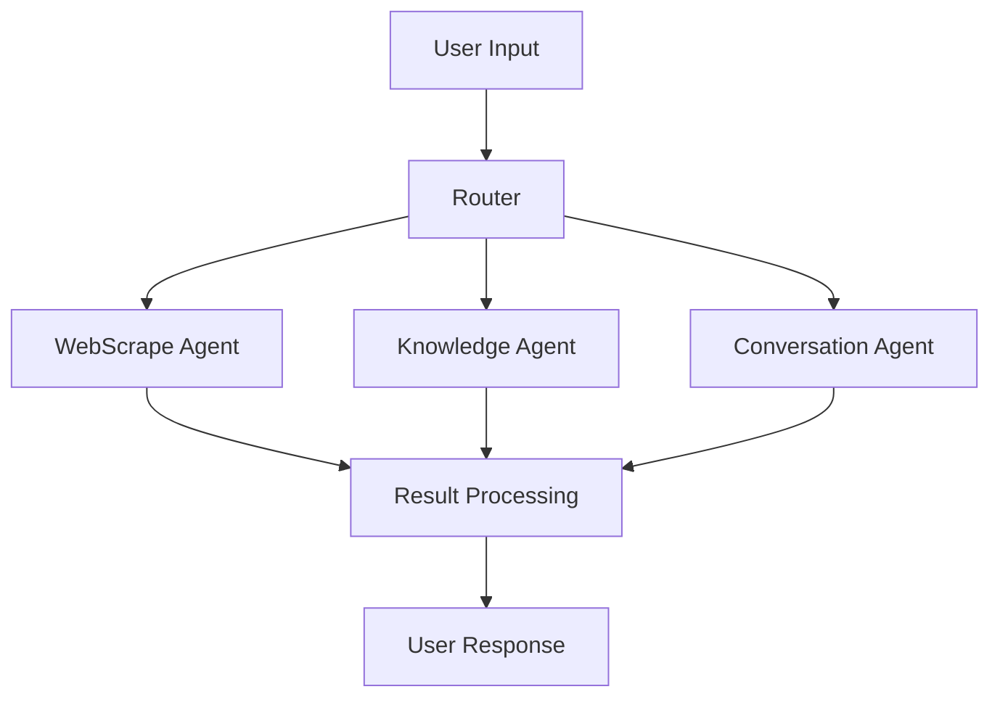

# Project Oracle Architecture

## System Overview

Project Oracle implements a multi-agent chat system using LangChain and LangGraph, featuring specialized agents for web scraping, knowledge base queries, and general conversation.

## Core Components

### Agent System Architecture


### Key Components

#### 1. Agent Framework
- **Router**: Intelligent query classification and routing
- **Specialized Agents**:
  - WebScrape Agent: Handles web content extraction
  - Knowledge Agent: Manages knowledge base queries
  - Conversation Agent: Handles general chat

#### 2. Knowledge Management
- JSON-based knowledge base
- Flexible topic matching
- Related content linking
- Article management

#### 3. Web Scraping System
- FireCrawl integration
- Markdown conversion
- File storage management
- Content summarization

## Data Flow

### 1. Input Processing
```python
User Query -> Router Analysis -> Agent Selection -> Processing -> Response
```

### 2. Agent Processing
Each agent follows a specific workflow:

#### WebScrape Agent
```python
URL Detection -> Content Extraction -> Markdown Conversion -> File Storage -> Summary Generation
```

#### Knowledge Agent
```python
Query Analysis -> Topic Matching -> Content Retrieval -> Response Formatting
```

#### Conversation Agent
```python
Context Analysis -> Response Generation -> Output Formatting
```

## Technical Implementation

### 1. State Management
```python
class AgentState(TypedDict):
    messages: Annotated[Sequence[BaseMessage], operator.add]
    next: str
```

### 2. Workflow Graph
```python
workflow = StateGraph(AgentState)
workflow.add_node("WebScrape", webscrape_node)
workflow.add_node("Knowledge", knowledge_node)
workflow.add_node("Conversation", conversation_node)
workflow.add_node("router", create_router())
```

### 3. Routing Logic
```python
workflow.add_conditional_edges(
    "router",
    lambda x: x["next"],
    {
        "WebScrape": "WebScrape",
        "Knowledge": "Knowledge",
        "Conversation": "Conversation"
    }
)
```

## Directory Structure
```
project-oracle/
├── dev.py                 # Main application
├── knowledge_base.json    # Knowledge storage
├── scrape_dump/          # Scraped content
├── docs/                 # Documentation
└── requirements.txt      # Dependencies
```

## Component Details

### WebScraper Class
- Handles web content extraction
- Manages file storage
- Implements error handling
- Provides content summaries

### KnowledgeBase Class
- Manages JSON data storage
- Implements fuzzy matching
- Handles topic relationships
- Manages article retrieval

### Router System
- Uses LLM for intent classification
- Maintains conversation context
- Handles agent selection
- Manages workflow transitions

## Performance Considerations

### Optimization Strategies
1. **Response Caching**
   - Frequently accessed knowledge
   - Common web scraping results
   - Regular conversation patterns

2. **Resource Management**
   - Configurable recursion limits
   - Timeout handling
   - Error recovery

3. **Content Processing**
   - Efficient markdown conversion
   - Optimized file storage
   - Smart content summarization

## Security Implementation

### Data Protection
- Environment variable management
- API key security
- File system security
- Input validation

### Error Handling
- Graceful failure recovery
- User feedback
- Logging system
- Debug capabilities

## Future Enhancements

### Planned Features
1. Database integration
2. Enhanced agent collaboration
3. Advanced content processing
4. UI implementation
5. Extended knowledge base capabilities

### Scalability Plans
1. Load balancing
2. Distributed processing
3. Enhanced caching
4. Performance monitoring

## Development Guidelines

### Adding New Agents
1. Create agent class
2. Define tools
3. Update router
4. Add workflow nodes
5. Update documentation

### Modifying Workflow
1. Update state definitions
2. Modify graph structure
3. Update routing logic
4. Test changes
5. Document modifications
